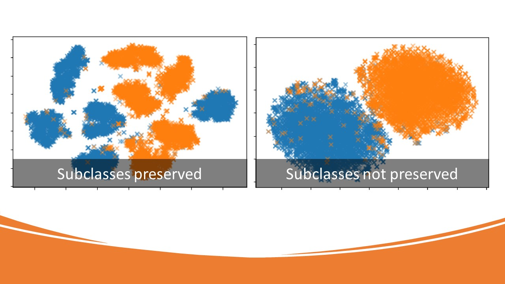

Multi-scale Deep Nearest Neighbors, IJCNN 2021

We propose a differentiable loss function for learning an embedding space by minimizing the upper bound of the leave-one-out classification error rate of 1-nearest neighbor
classification error in the latent space. To evaluate the resulting space, in addition to the classification performance, we examine the problem of finding subclasses. In many applications, it is desired to detect unknown subclasses that might exist within known classes. For example, discovering subtypes of a known disease may help develop customized treatments. Analogous to the hierarchical clustering, subclasses might exist on different scales. The proposed method provides a mechanism to target subclasses in different scales.

1. Build the docker file
docker build -t msdnn .

2. Run the docker file with gpu (make sure you in msdnn folder)
docker run -it --rm --gpus all -v $PWD/code:/home/python_user/app msdnn bash

3. Execute the code for training and evaluation on usps: we do search for all hyperparameters as described in the paper but the following hyperparamter setting tend to give the best results.
python3 msdnnAE.py --sigma 64 --epochs 500 --flip 1   --batch-size 1024 --lambdas 1 --save-path exp1
